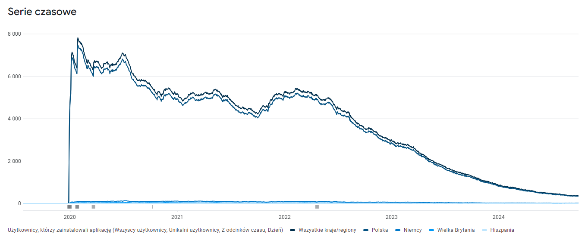

## "Ami Opowiada" – My First Major Google Play Release

"Ami Opowiada" was my first significant app release on Google Play. It was a platformer that told the story of Ami, who traveled through fantastical lands. The game achieved over 54,000 unique installs, received positive reviews, and generated a substantial amount of revenue through ads. Although the game is no longer available to players for various reasons, and I no longer support it, it was a fascinating project.

